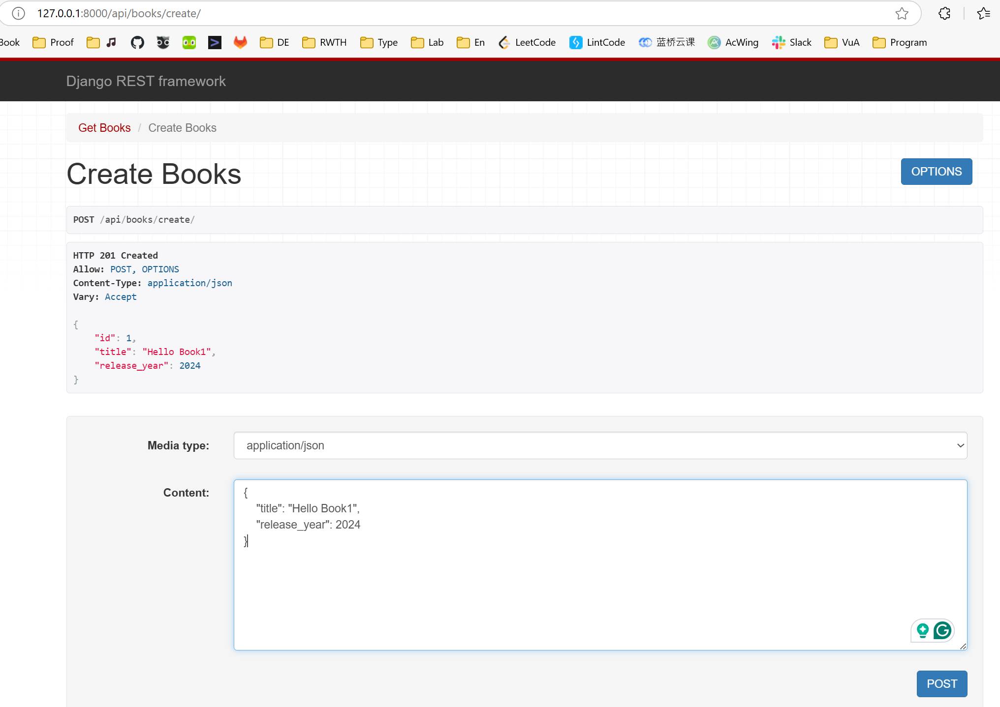
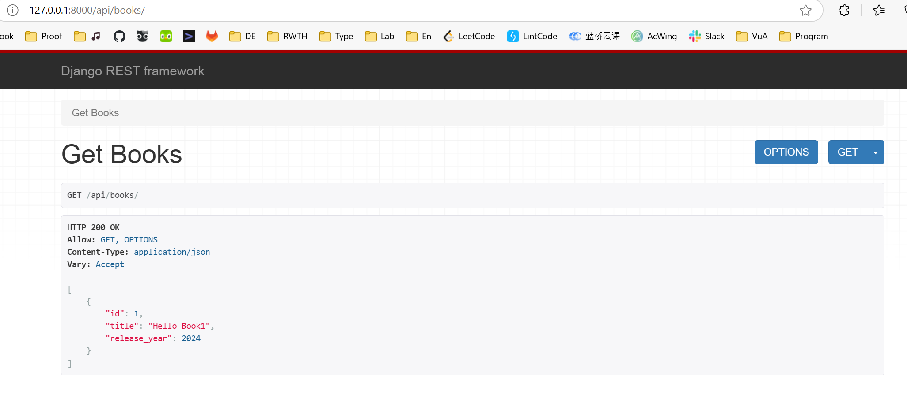

Backend -  implemented by Django
api, store data

1. 
```bash
python manage.py startapp api
```
2. add applications in settings.py (backend)
add packages (rest_frameworks, cores_headers), Installed_apps, middleware, route

3. go to the inplementation of application (api) and add function in it api - models.py

4. add migration (create models for classes) automatically
```
python manage.py makemigrations
```
generation **migrations** directory and **db.sqlite** file

```
python manage.py migrate
```

5. add serializer.py for api to transform json data into python data

6. add endpoint in views.py

7. create an urls.py file (api)

8. access the added urls.py by urls.py of the  project (backend)

9. The project can be runned
```
python manage.py runserver
```
follow the link http://127.0.0.1:8000/ to see generated websites

http://127.0.0.1:8000/api/books/   to check request for generated api


10. api/views.py
make a new post request
use json like text to test whether this requst is right
http://127.0.0.1:8000/api/books/create/

id is generated automatically 
get books can also get this info accordingly
